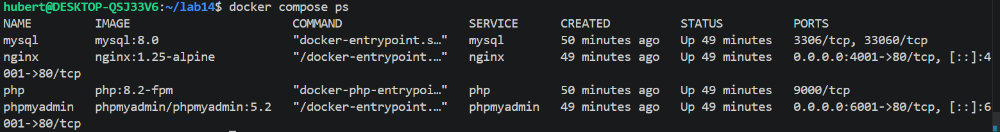
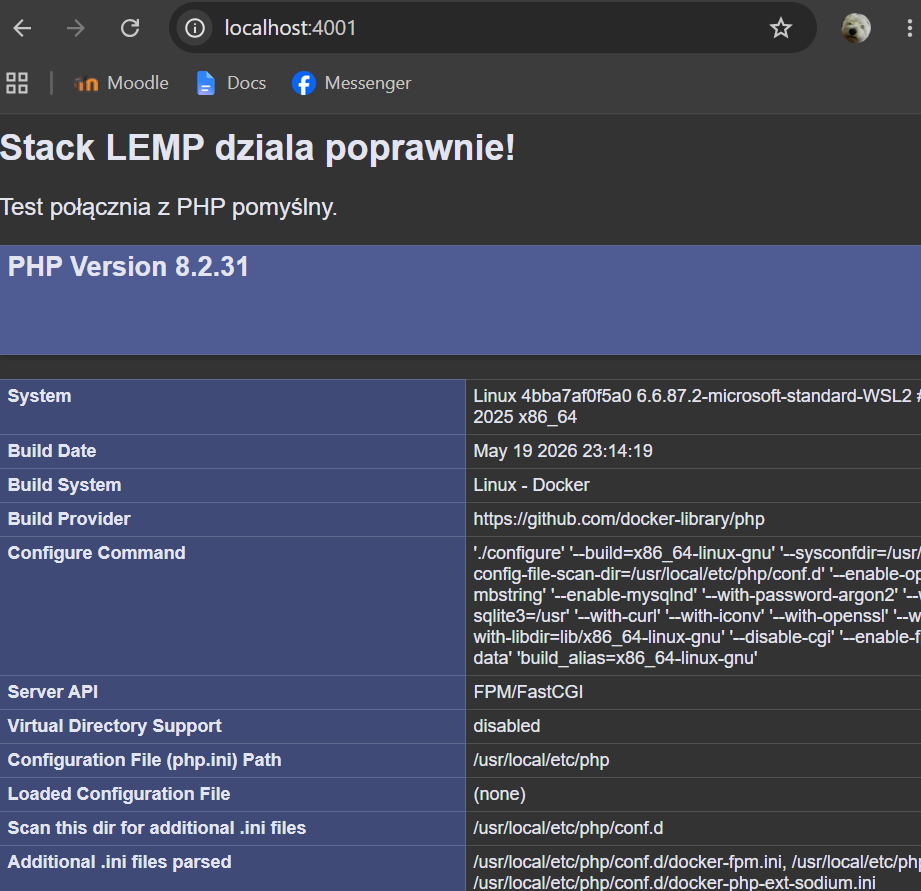
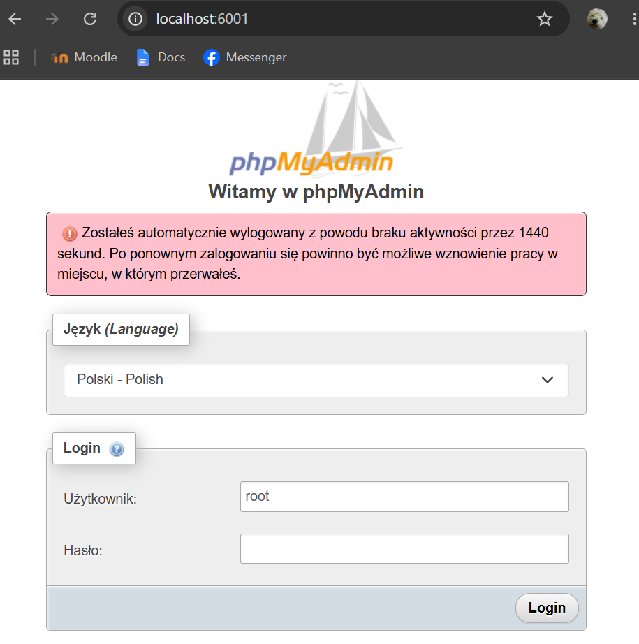
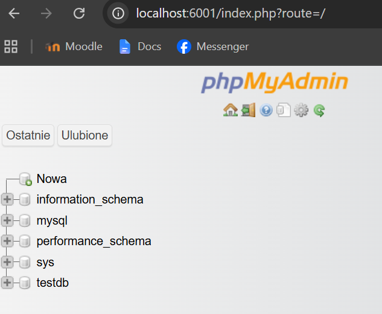

Sprawozdanie - Lab 14

Użyte komendy:
docker compose up -d (odpalenie w tle)
docker compose ps (sprawdzenie kontenerów)
docker compose down (wyłączenie i usunięcie)

Sieci i phpMyAdmin:
Zgodnie z zadaniem PHP i MySQL są w sieci backend, a Nginx w obu (frontend i backend).
phpMyAdmin dałem tylko do sieci backend, bo jako klient bazy potrzebuje tylko połączenia z kontenerem mysql. Nie musi być w sieci frontend, bo port 6001 wystawiamy bezpośrednio na hoście. Tak jest po prostu bezpieczniej.

Testowanie:
Pod localhost:4001 działa skrypt index.php, więc Nginx i PHP ze sobą gadają.
Pod localhost:6001 odpala się phpMyAdmin. 
Logowanie: root
Hasło: rootpassword
Założyłem testową bazę danych i wszystko działa.

