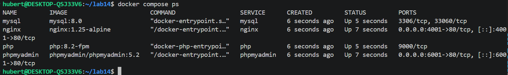
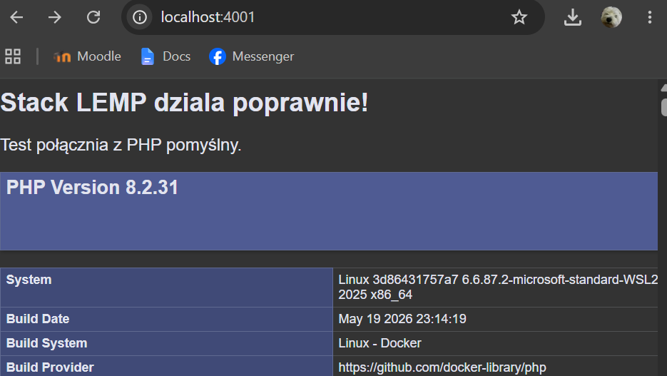
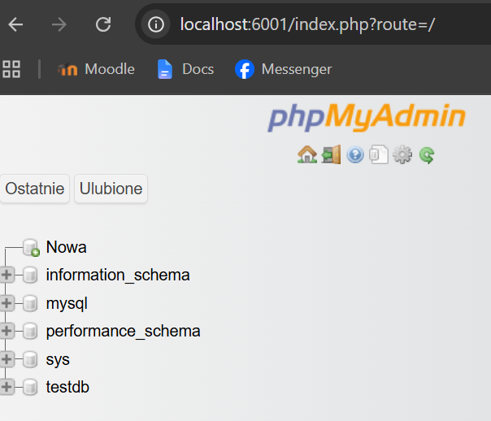

Sprawozdanie - Lab 14d

Modyfikacja konfiguracji
Względem poprzedniego zadania, usunąłem jawne hasła z pliku docker-compose. Zamiast zmiennych MYSQL_ROOT_PASSWORD użyłem MYSQL_ROOT_PASSWORD_FILE, które wskazują na ścieżkę /run/secrets/. Na dole pliku docker-compose dodałem sekcję secrets, która mapuje lokalne pliki tekstowe db_root_password.txt oraz db_password.txt do wnętrza kontenera.

Użyte polecenia
docker compose up -d - polecenie zbudowało i uruchomiło zmodyfikowane kontenery. Docker automatycznie wczytał hasła z plików txt jako sekrety.
docker compose ps - polecenie potwierdziło, że wszystkie 4 usługi (mysql, php, nginx, phpmyadmin) działają poprawnie i nie zresetowały się z powodu błędu autoryzacji.

Dowody działania
Stack LEMP nadal działa poprawnie. Po wejściu na http://localhost:4001 poprawnie wyświetla się strona startowa index.php, co udowadnia, że Nginx i PHP działają ze sobą jak wcześniej.
Z kolei panel bazy danych pod http://localhost:6001 pozwala na logowanie na użytkownika root z hasłem zaciągniętym z pliku db_root_password.txt. Zalogowałem się i utworzyłem testową bazę danych, co potwierdza, że MySQL poprawnie zainicjował się przy użyciu mechanizmu Docker Secrets. Do sprawozdania dołączam zrzuty ekranu z działającej strony PHP, panelu bazy i terminala.

